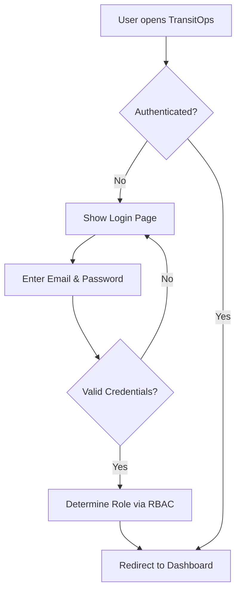
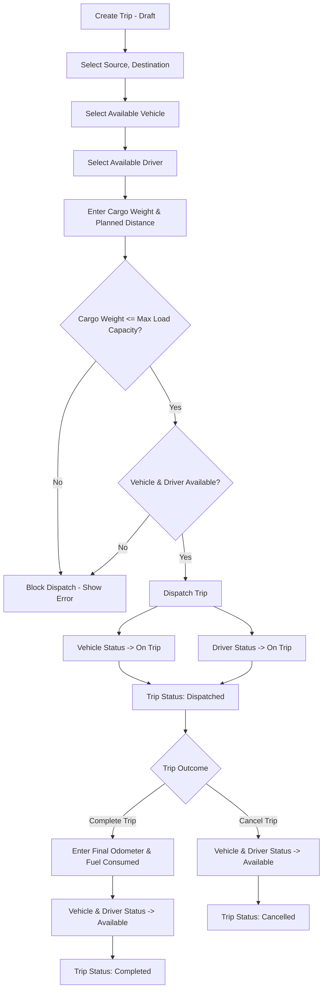
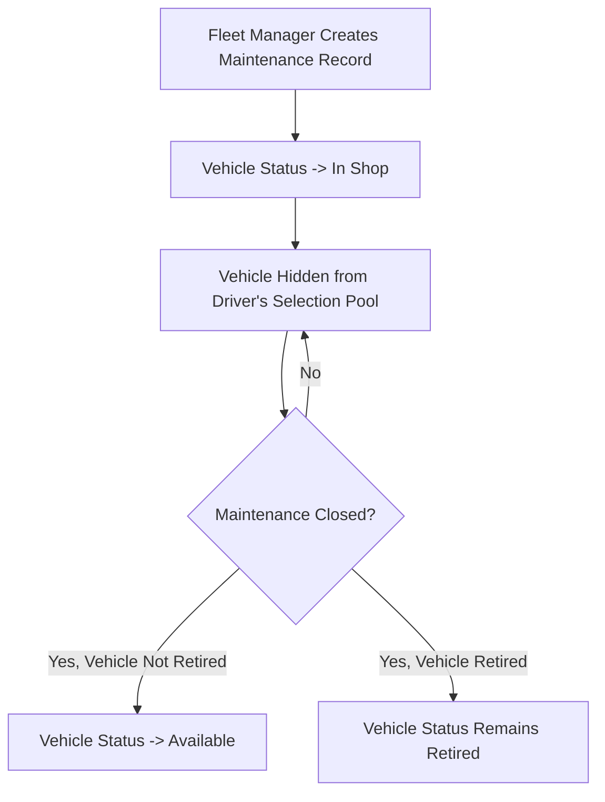
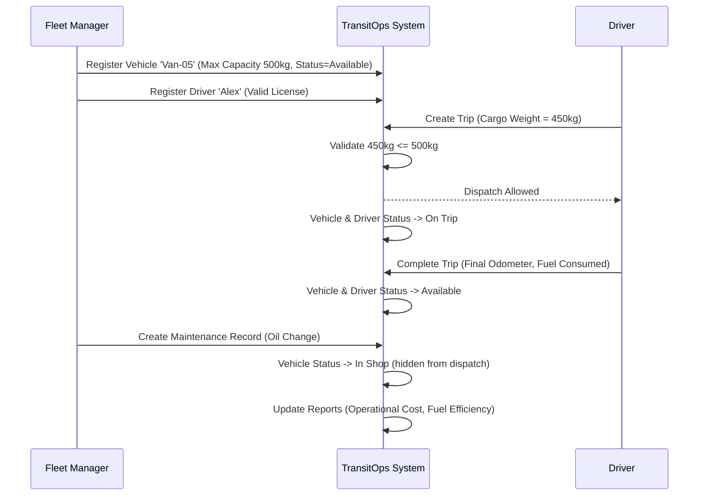

# Product Requirements Document (PRD)
## TransitOps — Smart Transport Operations Platform

**Document Owner:** Product Management
**Version:** 1.0
**Status:** Draft for Development
**Source Reference:** TransitOps Hackathon Brief (8-Hour Build)

---

## 1. Executive Summary

TransitOps is a centralized, web-based transport operations platform designed to digitize the full lifecycle of fleet management — from vehicle registration and driver onboarding to trip dispatching, maintenance tracking, fuel/expense logging, and operational analytics. It replaces manual, spreadsheet-based processes with a single system of record that enforces business rules (e.g., load capacity limits, license validity, vehicle/driver availability) and gives four distinct user roles the visibility and tools they need to run a safe, efficient, and cost-transparent fleet operation.

This PRD translates the original hackathon brief into a structured specification suitable for design, engineering, and QA teams to build against without needing to refer back to the source document.

---

## 2. Product Overview

TransitOps is a role-based web application covering five operational domains:

1. **Vehicle Registry** — master data for fleet assets
2. **Driver Management** — driver profiles and compliance status
3. **Trip Management** — dispatch lifecycle with validation rules
4. **Maintenance Management** — service records tied to vehicle availability
5. **Fuel & Expense Management** — cost tracking and reporting

The platform is accessed through a responsive web interface, secured via authentication and Role-Based Access Control (RBAC), and surfaces operational insights through a KPI dashboard and analytics/reports module.

---

## 3. Problem Statement

Many logistics companies currently manage transport operations using **spreadsheets and manual logbooks**. This leads to:

| Problem | Operational Impact |
|---|---|
| No centralized scheduling | Scheduling conflicts (double-booked vehicles/drivers) |
| No real-time visibility | Underutilized vehicles |
| No automated maintenance tracking | Missed maintenance, unsafe vehicles in service |
| No compliance tracking | Expired driver licenses go unnoticed |
| Manual expense recording | Inaccurate expense tracking |
| No consolidated reporting | Poor operational visibility for decision-making |

TransitOps addresses these gaps by digitizing the workflow and enforcing business rules automatically at the point of data entry.

---

## 4. Goals & Success Metrics

> **Note (Assumption):** The source brief does not define explicit success metrics or KPIs targets. The metrics below are derived directly from the KPIs the brief requires the Dashboard to display. Numeric targets are not specified in the source and are flagged in Section 15 (Open Questions).

### Product Goals
- Eliminate scheduling conflicts through automated availability validation.
- Increase fleet utilization visibility via real-time KPIs.
- Prevent non-compliant dispatches (expired licenses, suspended drivers, overloaded cargo).
- Provide a single source of truth for operational costs (fuel + maintenance) and profitability (ROI).
- Replace manual logbooks with a structured, auditable digital workflow.

### Success Metrics (derived from required KPIs)
| Metric | Definition |
|---|---|
| Active Vehicles | Count of vehicles currently in operational status |
| Available Vehicles | Count of vehicles with status = Available |
| Vehicles in Maintenance | Count of vehicles with status = In Shop |
| Active Trips | Count of trips with status = Dispatched |
| Pending Trips | Count of trips with status = Draft |
| Drivers On Duty | Count of drivers with status = On Trip / Available (on duty) |
| Fleet Utilization (%) | Proportion of fleet actively deployed vs. total fleet |
| Fuel Efficiency | Distance / Fuel consumed |
| Operational Cost | Fuel cost + Maintenance cost |
| Vehicle ROI | (Revenue − (Maintenance + Fuel)) / Acquisition Cost |

---

## 5. Target Users / Personas

| Persona | Role Description | Primary Needs |
|---|---|---|
| **Fleet Manager** | Oversees fleet assets, maintenance, vehicle lifecycle, and operational efficiency | Vehicle registry control, maintenance oversight, utilization visibility |
| **Driver** | Creates trips, assigns vehicles and drivers, and monitors active deliveries | Ability to create/dispatch trips, view assignment status |
| **Safety Officer** | Ensures driver compliance, tracks license validity, and monitors safety scores | Driver compliance dashboard, license expiry tracking, safety score monitoring |
| **Financial Analyst** | Reviews operational expenses, fuel consumption, maintenance costs, and profitability | Cost reports, fuel logs, ROI and expense analytics |

> **Open Question:** The brief lists "Driver" as a persona who "creates trips, assigns vehicles and drivers" — this is unusual, as typically a dispatcher/fleet manager would assign resources rather than the driver themselves. This is preserved as-is from the source brief; see Section 15.

---

## 6. User Roles & Permissions

The brief mandates RBAC but does not specify a detailed permission matrix per module. The matrix below is constructed strictly from responsibilities explicitly stated per persona in Section 5. Cells marked **(Assumption)** are inferred to make the system usable and should be validated with stakeholders.

| Module | Fleet Manager | Driver | Safety Officer | Financial Analyst |
|---|---|---|---|---|
| Vehicle Registry (CRUD) | Full access | View only *(Assumption)* | View only *(Assumption)* | View only *(Assumption)* |
| Driver Management (CRUD) | View/Edit *(Assumption)* | View only *(Assumption)* | Full access (compliance fields) | View only *(Assumption)* |
| Trip Management | View | Create/Assign/Dispatch/Complete/Cancel | View | View |
| Maintenance Logs | Full access | No access *(Assumption)* | View only *(Assumption)* | View (cost data) *(Assumption)* |
| Fuel & Expense Logs | View/Edit *(Assumption)* | Create (fuel logs on trip completion) *(Assumption)* | View only *(Assumption)* | Full access |
| Dashboard/KPIs | Full view | Limited (own trips) *(Assumption)* | Compliance-focused view *(Assumption)* | Cost-focused view *(Assumption)* |
| Reports & Analytics | Full access | No access *(Assumption)* | Compliance reports *(Assumption)* | Full access |

**Authentication requirement (from brief):** Only authenticated users may access the application; login via email and password.

---

## 7. Functional Requirements (User Stories & Acceptance Criteria)

### 7.1 Authentication

**User Story:** As a user, I want to log in securely with my email and password so that only authorized personnel can access the platform.

**Acceptance Criteria:**
- Given valid credentials, when a user submits the login form, then they are authenticated and redirected to the dashboard.
- Given invalid credentials, when a user submits the login form, then an error message is displayed and access is denied.
- Given an unauthenticated request to any application route, when accessed, then the user is redirected to the login page.
- Given a user is authenticated, when their role is determined, then RBAC restricts visible modules/actions per Section 6.

---

### 7.2 Dashboard

**User Story:** As a Fleet Manager, I want to see key operational KPIs at a glance so that I can quickly assess fleet health.

**Acceptance Criteria:**
- Dashboard displays: Active Vehicles, Available Vehicles, Vehicles in Maintenance, Active Trips, Pending Trips, Drivers On Duty, and Fleet Utilization (%).
- Dashboard supports filtering by vehicle type, status, and region.
- KPI values update to reflect current data state (no manual refresh required to see the latest saved data — *(Assumption: real-time vs. on-load refresh not specified)*).

---

### 7.3 Vehicle Registry

**User Story:** As a Fleet Manager, I want to maintain a master list of vehicles so that I have accurate, up-to-date fleet asset data.

**Acceptance Criteria:**
- Each vehicle record includes: Registration Number (unique), Vehicle Name/Model, Type, Maximum Load Capacity, Odometer, Acquisition Cost, and Status.
- System rejects creation/edit of a vehicle if the Registration Number already exists.
- Status must be one of: `Available`, `On Trip`, `In Shop`, `Retired`.
- Vehicles with status `Retired` or `In Shop` are excluded from any dispatch/assignment selection list.

---

### 7.4 Driver Management

**User Story:** As a Safety Officer, I want to maintain driver profiles with compliance data so that only qualified, compliant drivers are dispatched.

**Acceptance Criteria:**
- Each driver record includes: Name, License Number, License Category, License Expiry Date, Contact Number, Safety Score, and Status.
- Status must be one of: `Available`, `On Trip`, `Off Duty`, `Suspended`.
- Drivers with an expired License Expiry Date are excluded from the driver selection pool at trip creation/dispatch.
- Drivers with status `Suspended` are excluded from the driver selection pool at trip creation/dispatch.

---

### 7.5 Trip Management

**User Story:** As a Driver, I want to create and dispatch trips with validated vehicle/driver/cargo data so that operations remain safe and conflict-free.

**Acceptance Criteria:**
- Trip creation requires: source, destination, an available vehicle, an available driver, cargo weight, and planned distance.
- Trip lifecycle status values: `Draft → Dispatched → Completed → Cancelled`.
- System blocks trip dispatch if Cargo Weight exceeds the selected vehicle's Maximum Load Capacity.
- System blocks assignment of a vehicle or driver already marked `On Trip` to another trip.
- On dispatch: vehicle status and driver status automatically change to `On Trip`.
- On completion: vehicle status and driver status automatically revert to `Available`.
- On cancellation of a dispatched trip: vehicle status and driver status revert to `Available`.

---

### 7.6 Maintenance

**User Story:** As a Fleet Manager, I want to log maintenance activity so that vehicles under service are automatically removed from dispatch availability.

**Acceptance Criteria:**
- Fleet Manager can create a maintenance record for any vehicle.
- Creating an active maintenance record automatically sets vehicle status to `In Shop`.
- A vehicle with status `In Shop` is removed from the driver's vehicle selection pool.
- Closing a maintenance record restores vehicle status to `Available`, unless the vehicle status is `Retired`.

---

### 7.7 Fuel & Expense Management

**User Story:** As a Financial Analyst, I want fuel and expense data logged and aggregated per vehicle so that I can track true operational cost.

**Acceptance Criteria:**
- Users can record fuel logs with: liters, cost, and date.
- Users can record other expenses such as tolls or maintenance-related costs.
- System automatically computes Total Operational Cost per vehicle as: `Fuel Cost + Maintenance Cost`.

---

### 7.8 Reports & Analytics

**User Story:** As a Financial Analyst, I want to view computed operational metrics and export them so that I can report on fleet profitability.

**Acceptance Criteria:**
- Reports display: Fuel Efficiency (`Distance / Fuel`), Fleet Utilization, Operational Cost, and Vehicle ROI (`(Revenue − (Maintenance + Fuel)) / Acquisition Cost`).
- Users can export report data to CSV.
- PDF export is available *(optional — bonus/nice-to-have, not mandatory; see Section 7 vs. Section 16 distinction)*.

> **Open Question:** "Revenue" is used in the ROI formula but is never defined as a captured data field anywhere else in the brief (no revenue/billing entity or field is listed under Vehicle, Trip, or Expense entities). This must be clarified before ROI can be implemented. See Section 15.

---

## 8. User Flows

### 8.1 Authentication & Access Flow

### 8.2 Trip Lifecycle Flow

### 8.3 Maintenance Flow

### 8.4 End-to-End Example Workflow (from brief)

---

## 9. Business Rules

These rules are mandatory per the source brief and must be enforced at the application/business logic layer (not merely at the UI level):

1. Vehicle Registration Number must be unique.
2. Retired or In Shop vehicles must never appear in dispatch selection.
3. Drivers with expired licenses or Suspended status cannot be assigned to trips.
4. A driver or vehicle already marked On Trip cannot be assigned to another trip.
5. Cargo Weight must not exceed the vehicle's maximum load capacity.
6. Dispatching a trip automatically changes both vehicle and driver status to On Trip.
7. Completing a trip automatically changes both vehicle and driver status back to Available.
8. Cancelling a dispatched trip restores vehicle and driver to Available.
9. Creating an active maintenance record automatically changes vehicle status to In Shop.
10. Closing maintenance restores the vehicle to Available (unless the vehicle is Retired).

---

## 10. Non-Functional Requirements

> **Note:** The source brief only explicitly specifies a "Responsive web interface" as a non-functional requirement. The items below marked *(Assumption)* are standard baseline expectations for a system enforcing data integrity and RBAC, but are not explicitly stated in the source and should be confirmed with stakeholders.

| Category | Requirement | Source |
|---|---|---|
| Responsiveness | Interface must be responsive across desktop and mobile viewports | Explicit (Mandatory Deliverables) |
| Availability | Application should be available during business operations *(Assumption)* | Assumption |
| Data Integrity | Uniqueness and status-transition rules must be enforced at the data layer, not just UI | Inferred from Business Rules |
| Performance | Dashboard KPIs should load without significant delay *(Assumption — no specific SLA given)* | Assumption |
| Scalability | System should support growth in vehicles/drivers/trips over time *(Assumption)* | Assumption |
| Auditability | Status transitions (e.g., trip/vehicle/driver) should be traceable *(Assumption — not explicitly required)* | Assumption |

---

## 11. UI/UX Requirements

- Responsive web interface (explicit, mandatory).
- A reference mockup is provided by the source brief via Excalidraw: `https://link.excalidraw.com/l/65VNwvy7c4X/1FHGDNgD2td` — design team should treat this as the visual reference for layout and screen structure.
- Dashboard must support filters by vehicle type, status, and region.
- Bonus/optional UI features explicitly listed in the brief (not mandatory):
  - Charts and visual analytics
  - Search, filters, and sorting (beyond dashboard filters)
  - Dark mode

---

## 12. API & Database Requirements

> The source brief does not specify API contracts, endpoints, or a technology stack. It does specify the expected database entities, listed below.

### 12.1 Expected Database Entities (from brief)
- Users
- Roles
- Vehicles
- Drivers
- Trips
- Maintenance Logs
- Fuel Logs
- Expenses

### 12.2 Inferred Entity Attributes (derived directly from functional requirements)

**Vehicle**
| Field | Notes |
|---|---|
| Registration Number | Unique, required |
| Vehicle Name/Model | Required |
| Type | Required |
| Maximum Load Capacity | Required |
| Odometer | Required |
| Acquisition Cost | Required |
| Status | Enum: Available, On Trip, In Shop, Retired |

**Driver**
| Field | Notes |
|---|---|
| Name | Required |
| License Number | Required |
| License Category | Required |
| License Expiry Date | Required |
| Contact Number | Required |
| Safety Score | Required |
| Status | Enum: Available, On Trip, Off Duty, Suspended |

**Trip**
| Field | Notes |
|---|---|
| Source | Required |
| Destination | Required |
| Vehicle (FK) | Must be Available at assignment |
| Driver (FK) | Must be Available at assignment |
| Cargo Weight | Must be ≤ vehicle Max Load Capacity |
| Planned Distance | Required |
| Final Odometer | Captured at completion |
| Fuel Consumed | Captured at completion |
| Status | Enum: Draft, Dispatched, Completed, Cancelled |

**Maintenance Log**
| Field | Notes |
|---|---|
| Vehicle (FK) | Required |
| Type/Description (e.g., Oil Change) | Required |
| Active/Closed state | Drives vehicle status transitions |

**Fuel Log**
| Field | Notes |
|---|---|
| Vehicle (FK) | Required |
| Liters | Required |
| Cost | Required |
| Date | Required |

**Expense**
| Field | Notes |
|---|---|
| Vehicle (FK) | Required |
| Type (e.g., toll, maintenance) | Required |
| Cost | Required |
| Date | Required |

**User / Role**
| Field | Notes |
|---|---|
| Email | Required, used for login |
| Password | Required (hashed) |
| Role | Enum: Fleet Manager, Driver, Safety Officer, Financial Analyst |

> **Open Question:** No API design, authentication protocol (e.g., JWT/session-based), or data storage technology is specified in the source brief. These are left to the engineering team's discretion unless otherwise directed by stakeholders.

---

## 13. Security Requirements

Explicitly stated in the source brief:
- Secure login via email and password.
- Role-Based Access Control (RBAC) to restrict access by role.
- Only authenticated users may access the application.

Not specified in the source but generally required for a system of this nature *(Assumptions — to be confirmed)*:
- Passwords should be stored using a secure hashing algorithm, never in plaintext.
- Session/token expiration and secure session handling.
- Input validation to prevent injection attacks on all forms (vehicle, driver, trip, expense entry).
- Role permissions must be enforced server-side, not just hidden in the UI.

---

## 14. Edge Cases & Error Handling

Derived directly from the mandatory business rules; the system must handle these explicitly:

| Scenario | Expected System Behavior |
|---|---|
| Duplicate vehicle registration number entered | Reject with a clear uniqueness error |
| Attempt to dispatch a trip with a Retired/In Shop vehicle | Vehicle must not appear in selection list at all |
| Attempt to assign a driver with expired license | Driver must not appear in selection list; if attempted via API, reject |
| Attempt to assign a Suspended driver | Driver must not appear in selection list; if attempted via API, reject |
| Attempt to assign a vehicle/driver already On Trip | Reject assignment with conflict error |
| Cargo Weight exceeds vehicle Max Load Capacity | Block trip creation/dispatch with validation error |
| Cancelling a Draft (non-dispatched) trip | *(Open Question — brief only defines restoration behavior for cancelling a "dispatched" trip; behavior for cancelling a Draft trip is unspecified)* |
| Closing maintenance on a Retired vehicle | Vehicle remains Retired (does not revert to Available) |
| Creating a second active maintenance record for a vehicle already In Shop | *(Open Question — not specified whether this is blocked or allowed)* |

---

## 15. Risks, Assumptions, and Open Questions

### Assumptions
1. Detailed RBAC permission matrix per module (Section 6) is inferred from persona responsibilities, not explicitly defined in the source.
2. Dashboard KPI refresh behavior (real-time vs. on-load) is not specified; assumed to reflect current saved data on page load.
3. Non-functional requirements beyond "responsive web interface" (availability, performance, scalability, auditability) are assumed based on standard practice, not explicitly required.
4. Security practices beyond login + RBAC (password hashing, session handling, input validation) are assumed as standard baseline, not explicitly required.
5. PDF export is treated as optional per explicit statement in Section 3.8 of the source; CSV export is mandatory.

### Open Questions (require stakeholder clarification)
1. **Revenue field**: The Vehicle ROI formula requires "Revenue," but no revenue/billing entity or field is defined anywhere in the brief's data model. How is per-vehicle revenue captured or calculated?
2. **Driver persona scope**: The brief states the Driver persona "creates trips, assigns vehicles and drivers, and monitors active deliveries" — this implies dispatch-level permissions typically associated with a dispatcher/fleet manager role. Should the Driver role really have trip-creation and assignment authority, or is this a dispatcher role mislabeled as "Driver"?
3. **Cancelling a Draft trip**: The brief only defines status-restoration behavior for cancelling a *dispatched* trip. What is the expected behavior/status flow for cancelling a trip still in Draft (which never had a vehicle/driver marked On Trip)?
4. **Multiple maintenance records**: Can a vehicle already In Shop have additional maintenance records created concurrently, or should this be blocked?
5. **Fleet Utilization (%) formula**: The exact calculation method (e.g., vehicles On Trip / total vehicles, or based on time-in-use) is not defined in the brief.
6. **Region field**: The dashboard requires filtering by "region," but no "region" field is defined under any entity (Vehicle, Driver, Trip). Where does this data originate?
7. **Numeric success targets**: No target values (e.g., target fleet utilization %, target cost reduction) are provided; Section 4 metrics are structural, not quantitative targets.

### Risks
| Risk | Impact | Mitigation |
|---|---|---|
| Undefined "Revenue" data source | Blocks ROI reporting feature (Section 7.8) | Clarify with stakeholders before Sprint covering Reports module |
| Ambiguous Driver role permissions | Could result in incorrect RBAC implementation | Confirm role definitions before RBAC implementation |
| Missing region data model | Dashboard region filter cannot be implemented as specified | Define region as a vehicle/driver attribute before Dashboard sprint |
| 8-hour hackathon scope vs. full PRD scope | Given original timeframe, full feature set (analytics, PDF export, dark mode, etc.) may exceed available time | Use Section 16 milestones and Section 7 (mandatory) vs. Section 8 bonus (Section 18) to prioritize |

---

## 16. Development Milestones

> The source brief specifies an 8-hour hackathon duration with a fixed set of "Mandatory Deliverables" and separate "Bonus Features." The milestones below sequence the **mandatory** scope logically; bonus features are deferred to Section 18 (Future Enhancements) per the brief's own labeling.

| Milestone | Scope | Depends On |
|---|---|---|
| M1: Auth & RBAC Foundation | Login, session handling, role-based route protection | — |
| M2: Core Master Data | Vehicle Registry CRUD, Driver Management CRUD | M1 |
| M3: Trip Management | Trip creation, validation rules, dispatch/complete/cancel lifecycle | M2 |
| M4: Maintenance Workflow | Maintenance record creation/closure, automatic vehicle status transitions | M2 |
| M5: Fuel & Expense Tracking | Fuel log and expense entry, per-vehicle cost aggregation | M2 |
| M6: Dashboard & KPIs | KPI computation and display, filters by type/status/region | M2, M3, M4 |
| M7: Reports & Analytics | Fuel efficiency, utilization, operational cost, ROI, CSV export | M5, M6 |
| M8: QA & Hardening | Full regression against business rules (Section 9), edge cases (Section 14) | M1–M7 |

---

## 17. Testing Requirements

Testing must validate every mandatory business rule as a discrete, traceable test case. Minimum required test coverage:

### 17.1 Functional Test Coverage
- Authentication: valid login, invalid login, unauthenticated access blocked.
- RBAC: each role sees/accesses only permitted modules and actions (per Section 6, pending stakeholder confirmation).
- Vehicle Registry: duplicate registration number rejected; status enum enforced.
- Driver Management: status enum enforced; expiry date logic validated.
- Trip Management:
  - Trip cannot dispatch with cargo weight > vehicle max load capacity.
  - Trip cannot assign a vehicle/driver already On Trip.
  - Trip cannot assign a driver with expired license or Suspended status.
  - Vehicle/driver status transitions correctly at Dispatch, Complete, and Cancel.
- Maintenance: creating an active record sets vehicle to In Shop and removes it from dispatch pool; closing restores to Available unless Retired.
- Fuel & Expense: operational cost correctly computed as Fuel + Maintenance per vehicle.
- Reports: Fuel Efficiency, Fleet Utilization, Operational Cost, and ROI formulas produce correct output against known test data; CSV export produces a valid, correctly formatted file.

### 17.2 Non-Functional Test Coverage
- Responsive layout verified across common breakpoints (mobile, tablet, desktop).
- Data integrity constraints (uniqueness, status enums) enforced at the backend/data layer, not bypassable via direct API calls.

### 17.3 Regression Testing
- Full re-test of all Section 9 Business Rules after any change to Trip, Vehicle, or Maintenance modules, given their tightly coupled status-transition logic.

---

## 18. Future Enhancements

Per the source brief's "Bonus Features" list (explicitly optional, not part of mandatory deliverables):

- Charts and visual analytics
- PDF export (noted as optional even within the Reports requirement itself)
- Email reminders for expiring driver licenses
- Vehicle document management
- Search, filters, and sorting (beyond baseline dashboard filters)
- Dark mode

---

*End of Document — This PRD is derived strictly from the provided TransitOps hackathon brief. All items not explicitly stated in the source are clearly marked as Assumptions or Open Questions per instruction.*
